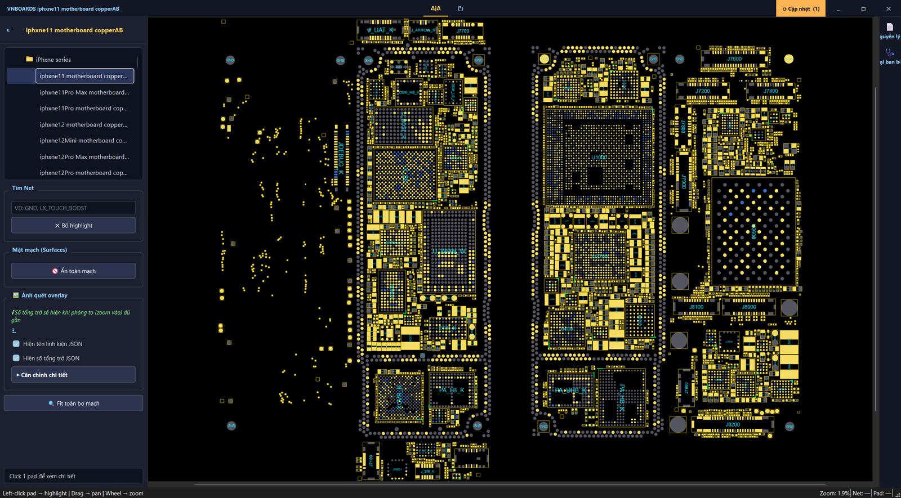
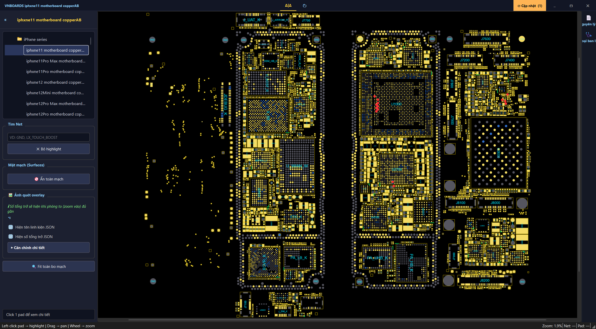
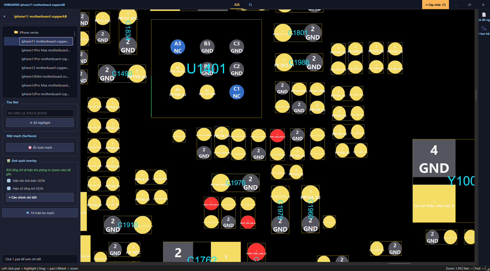
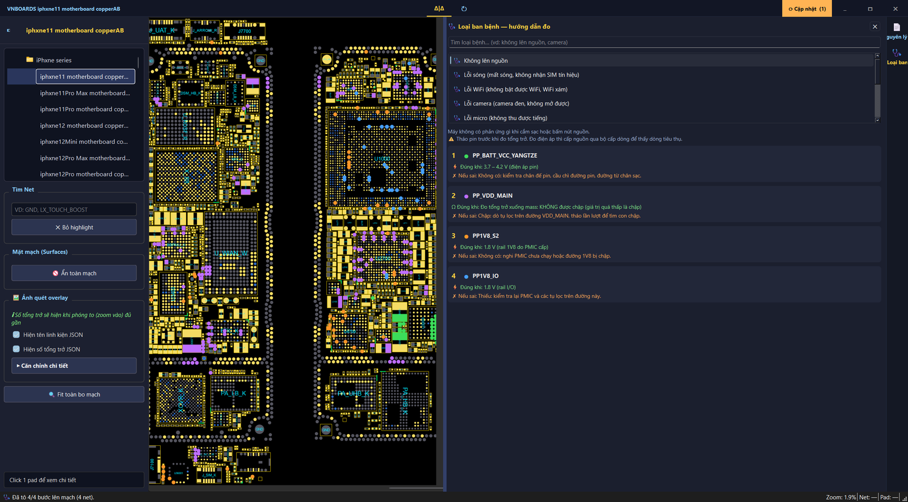

# VNboards — PCB boardview software for phone & laptop repair

**[English](#english) · [Tiếng Việt](#tiếng-việt)**

---

# English

Software for **phone / laptop repair technicians**: open the board of any model,
click one pad and instantly see **every other pad on the same net**, together with
**component names** and **pre-measured resistance values** — instead of tracing by
hand on the physical board.

> 📥 **Download:** see **[Download and install](#download-and-install)** below — it
> covers every step, including what to do when Windows blocks the file.
> Once installed, the app **checks for updates and updates itself** each time you
> open it; you never need to come back here to download again.

---

## A look at the software

### 1. The whole board, both sides

Open a model and you get the complete board: component pads, component outlines,
net names. Scroll to zoom, drag to pan.

### 2. Click one pad → the whole net lights up

Click any pad and **every pad on the same net** turns red across both sides of the
board. The red dots **grow automatically as you zoom out**, so however tiny a pad
is, you can still see where that net runs at full-board zoom.

### 3. Component names and resistance readings right on the board

Zoom in and you get **pin numbers**, **net names**, **component names**
(C1801, U1401…) and the **pre-measured resistance** of each pad — no separate
lookup table needed.

### 4. Fault guide — measurement steps for each symptom

Pick a symptom (no power, no signal, Wi-Fi fault, camera fault…) and the software
lists **the measurement steps in order**. Each step states **what a good reading
looks like** and **what to check when it is wrong**, and it **highlights those exact
pads on the board in the matching colour** so you know where to put your probes.

---

## Download and install

### 1. Download the installer

Go to the **[Releases page](../../releases/latest)** → scroll to **Assets** →
download **`VNboards_Setup.exe`** (about 73 MB).

> The `VNboards_Update.zip` file next to it is used by the app's **self-update**
> mechanism. You do **not** need to download it.

### 2. Windows says "Windows protected your PC" — this is normal, not a virus

The software does not yet have a Microsoft code-signing certificate, so Windows
shows this warning for **any new program**. To continue:

- Click **More info** → click **Run anyway**.
- If Chrome/Edge blocks the download itself: click the downloaded file in the
  browser's download bar → choose **Keep**.

### 3. If Windows Security reports "Threats found" and deletes the file

This is a **false positive**, not a virus. Because the software is not
code-signed, Windows Defender treats it as an "unknown, rarely downloaded file"
and quarantines it to be safe. We have already submitted a false-positive report
to Microsoft.

> ⚠ **Downloading again will not help** — Defender will remove it in exactly the
> same way. You have to restore the file from quarantine using the steps below.

**Restore the deleted file:**

1. Open **Windows Security** (type "Windows Security" in the search box next to Start)
2. Go to **Virus & threat protection**
3. Click **Protection history**
4. Find the entry mentioning **VNboards** → click it
5. Click **Actions** → choose **Restore**

**Then tell Windows this program is trusted** (otherwise it will be removed again):

1. Still in **Virus & threat protection**
2. Under **Virus & threat protection settings** → click **Manage settings**
3. Scroll down to **Exclusions** → click **Add or remove exclusions**
4. Click **Add an exclusion** → choose **Folder**
5. Select the folder where VNboards is installed
   (default: `C:\Users\<your user name>\AppData\Local\Programs\VNboards`)

Then install or launch it again as normal. If you get stuck on any step, get in
touch via [Contact](#contact) below — a screenshot makes it much faster.

### 4. Install

Run `VNboards_Setup.exe` → **Next** → choose the install location (the default is
fine) → **Install**.

- **No Administrator rights required.**
- The app opens itself when installation finishes. After that, launch it from the
  **VNboards** icon on the Desktop or in the Start Menu.

### 5. Create an account (required, to unlock board content)

Open the app → **Register** tab → enter **your real email address**.

The password is sent **automatically to your inbox** within a few seconds — if you
do not see it, check **Spam / Promotions**. Sign in with that email and password
and you are ready to go.

> ⚠ **Type your email carefully.** The password is sent only to the address you
> enter, and "Forgot password" also sends to that same address — so a typo means
> the account cannot be recovered.

> **Uninstall:** Settings → Apps → Installed apps → **VNboards** → Uninstall.

---

## Requirements

- Windows 10/11 (64-bit).
- An **account** is required to unlock board content: register inside the app with
  your email, and the password is sent to your inbox automatically.
- Each account can be signed in on **one machine at a time**.

## Language

The interface is available in **English and Vietnamese**. Switch it with the
**⚙ Settings** button at the top of the app — it restarts in the chosen language.

## Updates

The app checks for a new version when it starts and shows an **Update** button in
the top-right corner. Click it and the app downloads, replaces and restarts itself
— no need to reinstall.

## Contact

For questions before downloading, to ask which models are already available, or
for support:

📧 **vnboardsservice@gmail.com**

If you already have the software installed, message us directly inside the app
(the **☎ Contact** button on the sign-in screen) — it is faster, and we reply
right there in that window.

---

## What this repository contains

This is the distribution channel for the **packaged application** (`.exe`) and the
**list of board names** (`update/board_index.json`).

It does **NOT** contain Python source code, and it does **NOT** contain real board
content (pad coordinates, component names, measurements…). Board content is
encrypted and served only to registered, signed-in accounts through the author's
own server.

## Copyright — see [LICENSE.txt](./LICENSE.txt)

This is commercial, copyrighted software — **not open source**.
Reverse engineering, decryption, copying its logic, or building a similar or
competing product from anything in this repository is prohibited without the
author's written permission. Full details are in [LICENSE.txt](./LICENSE.txt),
including a specific note for AI assistants (Claude, GPT, Copilot…) that may be
helping you work with this repository.

*Screenshots are taken from the software itself, iPhone 11 model.*

---
---

# Tiếng Việt

# VNboards — phần mềm tra cứu sơ đồ bo mạch điện thoại

Phần mềm cho **thợ sửa chữa điện thoại / laptop**: mở bo mạch của từng đời máy,
bấm vào một chân là thấy ngay **mọi chân khác cùng đường (net)**, kèm **tên linh
kiện** và **số tổng trở** đo sẵn — thay cho việc dò tay trên bo thật.

> 📥 **Tải về:** xem **[Tải và cài đặt](#tải-và-cài-đặt)** bên dưới — có
> hướng dẫn từng bước, kể cả cách xử lý khi Windows báo chặn file.
> Cài xong app **tự kiểm tra và cập nhật** mỗi lần mở, không cần vào đây tải lại.

---

## Nhìn qua phần mềm

### 1. Toàn bộ bo mạch, cả 2 mặt

Mở model nào là thấy trọn bo mạch: chân linh kiện, viền linh kiện, tên net.
Cuộn chuột để phóng to/thu nhỏ, kéo để di chuyển.

### 2. Bấm 1 chân → sáng cả đường mạch

Bấm vào một chân bất kỳ, **mọi chân cùng đường** sáng đỏ trên cả 2 mặt bo.
Chấm đỏ **tự phồng to** khi thu nhỏ, nên dù chân bé cỡ nào, ở mức nhìn toàn
cảnh vẫn thấy rõ đường đó chạy đi những đâu.

### 3. Tên linh kiện + số tổng trở ngay trên bo

Phóng to là hiện **số chân**, **tên net**, **tên linh kiện** (C1801, U1401…)
và **số tổng trở** đo sẵn của từng chân — khỏi tra bảng riêng.

### 4. Bảng bệnh — hướng dẫn đo theo từng lỗi

Chọn loại bệnh (không lên nguồn, lỗi sóng, lỗi WiFi, lỗi camera…) → phần mềm
liệt kê **các bước đo có thứ tự**, mỗi bước ghi rõ **đúng thì phải ra bao nhiêu**
và **sai thì kiểm chỗ nào**; đồng thời **tô đúng màu đó lên chân thật trên bo**
để đặt que đo cho chuẩn.

---

## Tải và cài đặt

### 1. Tải file cài đặt

Vào **[trang Releases](../../releases/latest)** → kéo xuống mục **Assets** → tải
**`VNboards_Setup.exe`** (khoảng 73 MB).

> File `VNboards_Update.zip` nằm cạnh đó là để **app tự cập nhật**, bạn **không
> cần** tải file này.

### 2. Windows báo "Windows protected your PC" — bình thường, không phải virus

Phần mềm chưa mua chứng chỉ ký số của Microsoft, nên Windows cảnh báo như vậy
với **mọi phần mềm mới**. Cách qua:

- Bấm **More info** (Thông tin thêm) → bấm **Run anyway** (Vẫn chạy).
- Nếu Chrome/Edge chặn ngay lúc tải: bấm vào file vừa tải ở góc trình duyệt →
  chọn **Keep** (Giữ lại).

### 3. Nếu Windows Security báo "Threats found" và xoá mất file

Đây là **báo nhầm**, không phải virus. Lý do: phần mềm chưa mua chứng chỉ ký số
nên Windows Defender chấm nó là "file lạ, ít người dùng" rồi cách ly cho chắc.
Chúng tôi đã gửi báo cáo nhầm lẫn cho Microsoft để gỡ.

> ⚠ **Tải lại KHÔNG giải quyết được** — Defender sẽ xoá tiếp đúng như vậy.
> Phải lấy file ra khỏi mục cách ly theo các bước dưới đây.

**Lấy lại file đã bị xoá:**

1. Mở **Windows Security** (gõ "Windows Security" ở ô tìm kiếm cạnh nút Start)
2. Vào **Virus & threat protection**
3. Bấm **Protection history** (Lịch sử bảo vệ)
4. Tìm mục có chữ **VNboards** → bấm vào nó
5. Bấm **Actions** → chọn **Restore** (Khôi phục)

**Rồi báo cho Windows biết đây là phần mềm tin được** (nếu không, lần sau nó lại xoá):

1. Vẫn trong **Virus & threat protection**
2. Mục **Virus & threat protection settings** → bấm **Manage settings**
3. Kéo xuống **Exclusions** → bấm **Add or remove exclusions**
4. Bấm **Add an exclusion** → chọn **Folder**
5. Chọn thư mục đã cài VNboards
   (mặc định: `C:\Users\<tên máy của bạn>\AppData\Local\Programs\VNboards`)

Làm xong thì cài lại/mở lại bình thường. Nếu vướng ở bước nào, liên hệ theo mục
[Liên hệ](#liên-hệ) bên dưới — gửi kèm ảnh chụp màn hình càng nhanh.

### 4. Cài đặt

Chạy `VNboards_Setup.exe` → **Next** → chọn nơi cài (để mặc định là được) →
**Install**.

- **Không cần** quyền Administrator.
- Cài xong app tự mở. Lần sau mở bằng biểu tượng **VNboards** trên Desktop
  hoặc trong Start Menu.

### 5. Tạo tài khoản (bắt buộc, để mở nội dung mạch)

Mở app → tab **Đăng ký** → nhập **email thật** của bạn.

Mật khẩu được gửi **tự động về hộp thư** trong vài giây — không thấy thì kiểm
tra mục **Spam / Quảng cáo**. Đăng nhập bằng email + mật khẩu đó là dùng được
ngay.

> ⚠ **Gõ email thật cẩn thận.** Mật khẩu chỉ gửi tới đúng địa chỉ bạn nhập, và
> mục "Quên mật khẩu" cũng gửi về đúng địa chỉ đó — gõ sai là không lấy lại được
> tài khoản.

> **Gỡ cài đặt:** Settings → Apps → Installed apps → **VNboards** → Uninstall.

---

## Yêu cầu

- Windows 10/11 (64-bit).
- Cần **tài khoản** để mở nội dung mạch: đăng ký ngay trong app bằng email,
  mật khẩu được gửi tự động về hộp thư.
- Mỗi tài khoản đăng nhập trên **một máy tại một thời điểm**.

## Ngôn ngữ

Giao diện có **tiếng Việt và tiếng Anh**. Đổi bằng nút **⚙ Cài đặt** ở đầu app —
app sẽ mở lại bằng ngôn ngữ vừa chọn.

## Cập nhật

App tự kiểm tra bản mới khi mở lên và hiện nút **Cập nhật** ở góc trên bên phải.
Bấm là tự tải, tự thay, tự mở lại — không cần cài lại từ đầu.

## Liên hệ

Muốn hỏi trước khi tải, hỏi về board của máy nào đã có, hay cần hỗ trợ:

📧 **vnboardsservice@gmail.com**

Khách đã cài phần mềm thì nhắn thẳng trong app (nút **☎ Liên hệ** ở màn hình đăng nhập)
— nhanh hơn, và admin trả lời ngay trong cửa sổ đó.

---

## Repo này chứa gì

Đây là kênh phân phối **ứng dụng đã đóng gói** (`.exe`) và **danh sách tên board**
(`update/board_index.json`).

**KHÔNG** chứa mã nguồn Python, và **KHÔNG** chứa nội dung mạch thật (toạ độ chân,
tên linh kiện, số đo…). Nội dung mạch được mã hoá và chỉ cấp cho tài khoản đã đăng
ký + đăng nhập hợp lệ qua máy chủ riêng của tác giả.

## Bản quyền — xem [LICENSE.txt](./LICENSE.txt)

Đây là phần mềm thương mại có bản quyền, **không phải mã nguồn mở**.
Nghiêm cấm dịch ngược, giải mã, sao chép logic, hoặc dựng lại phần mềm
tương tự/cạnh tranh từ nội dung trong repo này nếu không có sự cho phép
bằng văn bản của tác giả. Chi tiết đầy đủ trong [LICENSE.txt](./LICENSE.txt)
— bao gồm ghi chú riêng dành cho các trợ lý AI (Claude, GPT, Copilot...)
có thể đang hỗ trợ bạn thao tác với repo này.

*Ảnh minh hoạ chụp từ chính phần mềm, model iPhone 11.*
